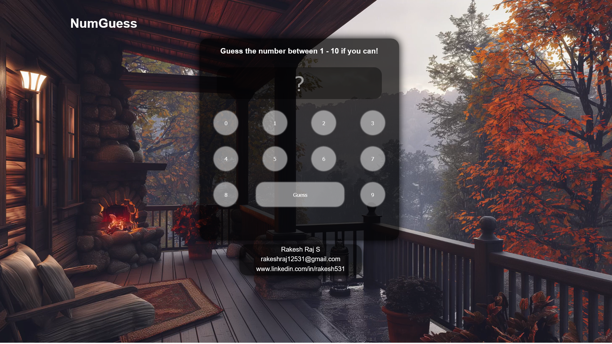

# 🔢 NumGuess - A Jungle-Themed Number Guessing Game 🌲🎮

**NumGuess** is a sleek and aesthetic number guessing game built with HTML, CSS, and JavaScript. Set against a peaceful forest video backdrop 🌳, the game challenges you to guess a random number between 1 and 10. Can you beat the odds? 🧠💥

---

## 📸 Preview

---

## 📽️ YouTube Video Demo

🎬 Watch it in action here:  
👉 [NumGuess - Number Guessing Game with Forest Vibes](https://youtu.be/Fal1pHe1caE)

---

## 🌐 Live Demo

🚀 Try it out now:  
🔗 [https://rakesh12531.github.io/num-guess-project/](https://rakesh12531.github.io/num-guess-project/)

---

## ✨ Features

- 🎯 Guess numbers between 1 and 10
- 🌲 Video background for immersive gameplay
- 🧠 Simple logic, great fun!
- 🎨 Clean UI & Responsive design
- 👇 On-screen number pad
- ✅ Instant feedback

---

## 🛠️ Tech Stack

- **HTML5**
- **CSS3**
- **JavaScript (Vanilla)**
- 🔁 Video Background Integration

---

## 👨‍💻 Author

**Rakesh Raj S**  
📧 rakeshraj12531@gmail.com  
🔗 [LinkedIn – rakesh531](https://www.linkedin.com/in/rakesh531)  
💻 [GitHub – rakesh12531](https://github.com/rakesh12531)

---

> 🎉 This project is part of my web dev learning journey. Drop a ⭐ if you like it, and feel free to fork or contribute!

